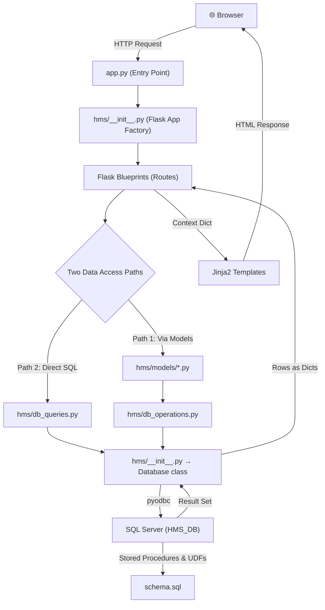
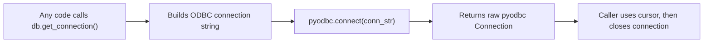
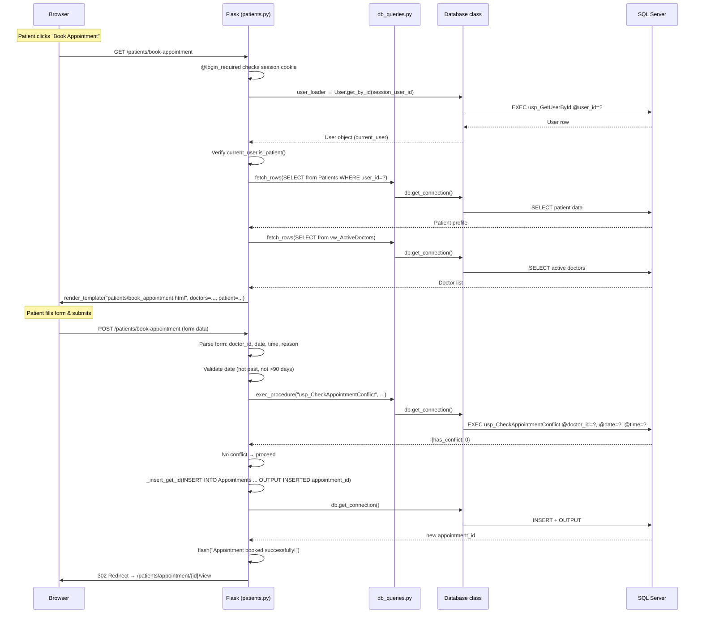
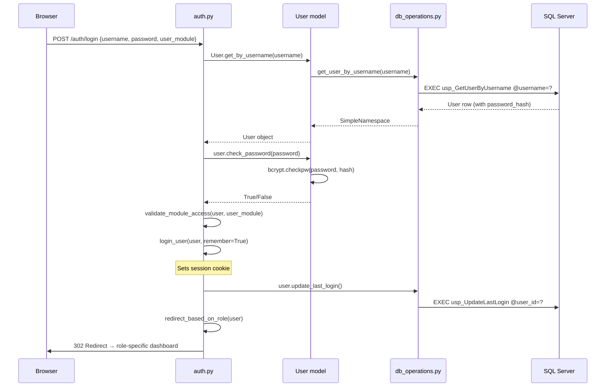

# 🏥 Hospital Management System — Architecture & Data Flow Walkthrough

---

## High-Level Architecture



---

## Layer-by-Layer Breakdown

### 1️⃣ Entry Point — [app.py](file:///d:/Projects/Website%20Projects/xyz/hospital-management-system/app.py)

This is where everything starts when you run `python app.py`:

```python
from hms import create_app

app = create_app()

if __name__ == '__main__':
    app.run(debug=True, host='0.0.0.0', port=5000)
```

- Imports the **app factory** `create_app()` from the `hms` package
- Creates the Flask app instance
- Starts the dev server on `http://0.0.0.0:5000`

---

### 2️⃣ App Factory — [hms/__init__.py](file:///d:/Projects/Website%20Projects/xyz/hospital-management-system/hms/__init__.py)

`create_app()` is a **Flask Application Factory** — it builds and configures the entire app. Here's what it does **in order**:

| Step | What Happens | Key Code |
|------|-------------|----------|
| 1 | **Load config** from [config.py](file:///d:/Projects/Website%20Projects/xyz/hospital-management-system/config.py) | `app.config.from_object(config[config_name])` |
| 2 | **Read DB connection params** from `.env` | `db_params = get_db_connection_params()` |
| 3 | **Initialize Database wrapper** | `db.init_app(app)` |
| 4 | **Initialize Flask-Login** | `login_manager.init_app(app)` |
| 5 | **Register user loader** for sessions | `@login_manager.user_loader` → `User.get_by_id()` |
| 6 | **Inject template globals** (`now`, `today`, `global_low_stock`) | `@app.context_processor` |
| 7 | **Register all 7 Blueprints** | `app.register_blueprint(...)` |
| 8 | **Set up root redirect** (`/` → dashboard or login) | `@app.route('/')` |
| 9 | **Register error handlers** (404, 500, 403) | `@app.errorhandler(...)` |
| 10 | **Test DB connection** on startup | `conn = db.get_connection(); conn.close()` |

> [!IMPORTANT]
> Two **singleton objects** are created at module level and shared across the entire app:
> - `db = Database()` — the raw pyodbc connection manager
> - `login_manager = LoginManager()` — session/auth management

---

### 3️⃣ Configuration — [config.py](file:///d:/Projects/Website%20Projects/xyz/hospital-management-system/config.py)

Reads `.env` variables and builds connection parameters:

```
.env  →  DB_SERVER, DB_NAME, DB_USERNAME, DB_PASSWORD, MSSQL_ODBC_DRIVER
              ↓
      get_db_connection_params()
              ↓
      Returns dict: { driver, server, database, username, password, uri, type }
```

For your local setup, it defaults to:
- **Server:** `localhost\SQLEXPRESS`
- **Database:** `HMS_DB`
- **Driver:** `ODBC Driver 17 for SQL Server`
- **Auth:** Windows Trusted Connection (when no username/password set)

---

### 4️⃣ Database Connection Layer — `Database` class in [hms/__init__.py](file:///d:/Projects/Website%20Projects/xyz/hospital-management-system/hms/__init__.py#L8-L36)

This is a **thin wrapper** around pyodbc:



> [!NOTE]
> Every DB call creates a **fresh connection** and closes it when done. There is no connection pooling — this is a per-request model typical of simpler Flask apps.

---

### 5️⃣ Data Access — The Two Paths

Your app has **two parallel data access modules**. Both ultimately do the same thing (execute SQL via pyodbc), but they're used by different parts of the app:

```mermaid
graph TD
    subgraph "Path A — Used by auth.py, admin.py, staff.py, billing.py, pharmacy.py"
        A1["Route handler"] --> A2["hms/models/*.py (e.g. User.get_by_username)"]
        A2 --> A3["hms/db_operations.py"]
        A3 --> A4["execute_procedure() / execute_query()"]
        A4 --> A5["db.get_connection() → pyodbc → SQL Server"]
    end

    subgraph "Path B — Used by patients.py, appointments.py"
        B1["Route handler"] --> B2["hms/db_queries.py"]
        B2 --> B3["exec_procedure() / fetch_rows()"]
        B3 --> B4["db.get_connection() → pyodbc → SQL Server"]
    end
```



#### Path A: `db_operations.py` (930 lines)
- The **primary** data access layer
- Contains **domain-specific functions** like `get_patient_by_id()`, `create_appointment()`, `list_bills()`
- Each function calls a **stored procedure** (e.g. `EXEC usp_GetPatientById @patient_id=?`)
- Returns `SimpleNamespace` objects (dot-accessible: `patient.first_name`)
- Used by **model classes** (User, Doctor, Patient, etc.) and most route files

#### Path B: `db_queries.py` (76 lines)
- A **lightweight** alternative with just 3 functions: `fetch_rows()`, `exec_procedure()`, `rows_to_objects()`
- Used by `patients.py` and `appointments.py` routes which write **inline SQL** directly in the route handlers
- Returns raw `dict` rows, converted to `SimpleNamespace` via `rows_to_objects()`

---

### 6️⃣ Model Layer — [hms/models/](file:///d:/Projects/Website%20Projects/xyz/hospital-management-system/hms/models)

Models are **not ORM models** — they're plain Python classes that wrap `db_operations` calls:

| Model | File | Purpose |
|-------|------|---------|
| `User` | [user.py](file:///d:/Projects/Website%20Projects/xyz/hospital-management-system/hms/models/user.py) | Auth, Flask-Login integration, password hashing (bcrypt) |
| `Patient` | [patient.py](file:///d:/Projects/Website%20Projects/xyz/hospital-management-system/hms/models/patient.py) | Patient CRUD wrappers |
| `Doctor` | [doctor.py](file:///d:/Projects/Website%20Projects/xyz/hospital-management-system/hms/models/doctor.py) | Doctor operations |
| `Appointment` | [appointment.py](file:///d:/Projects/Website%20Projects/xyz/hospital-management-system/hms/models/appointment.py) | Appointment operations |
| `Billing` | [billing.py](file:///d:/Projects/Website%20Projects/xyz/hospital-management-system/hms/models/billing.py) | Bill and payment operations |
| `Medicine/Pharmacy` | [pharmacy.py](file:///d:/Projects/Website%20Projects/xyz/hospital-management-system/hms/models/pharmacy.py) | Medicine & prescription ops |
| `Admission` | [admission.py](file:///d:/Projects/Website%20Projects/xyz/hospital-management-system/hms/models/admission.py) | Patient admission/discharge |

The `User` model is special — it implements `UserMixin` from Flask-Login:

```python
class User(UserMixin):
    # Flask-Login requires these:
    def get_id(self):        # Returns user_id as string
        return str(self.user_id)

    @property
    def is_active(self):     # Account enabled?
        return self._is_active

    # Password management uses bcrypt:
    def set_password(self, password):   # Hash & store
    def check_password(self, password): # Verify against hash

    # Role checks:
    def is_admin(self):   → role == 'admin'
    def is_doctor(self):  → role == 'doctor'
    def is_patient(self): → role == 'patient'
    # etc.
```

---

### 7️⃣ Routes / Blueprints — [hms/routes/](file:///d:/Projects/Website%20Projects/xyz/hospital-management-system/hms/routes)

Each blueprint handles a domain area:

| Blueprint | Prefix | File | Key Responsibility |
|-----------|--------|------|-------------------|
| `auth_bp` | `/auth` | [auth.py](file:///d:/Projects/Website%20Projects/xyz/hospital-management-system/hms/routes/auth.py) | Login, logout, signup, profile, change password |
| `patients_bp` | `/patients` | [patients.py](file:///d:/Projects/Website%20Projects/xyz/hospital-management-system/hms/routes/patients.py) | Patient CRUD, dashboard, booking, profile |
| `appointments_bp` | `/appointments` | [appointments.py](file:///d:/Projects/Website%20Projects/xyz/hospital-management-system/hms/routes/appointments.py) | Staff-side appointment management |
| `staff_bp` | `/staff` | [staff.py](file:///d:/Projects/Website%20Projects/xyz/hospital-management-system/hms/routes/staff.py) | Doctor/nurse dashboards, staff CRUD |
| `billing_bp` | `/billing` | [billing.py](file:///d:/Projects/Website%20Projects/xyz/hospital-management-system/hms/routes/billing.py) | Bills, payments, line items |
| `pharmacy_bp` | `/pharmacy` | [pharmacy.py](file:///d:/Projects/Website%20Projects/xyz/hospital-management-system/hms/routes/pharmacy.py) | Medicine inventory, prescriptions |
| `admin_bp` | `/admin` | [admin.py](file:///d:/Projects/Website%20Projects/xyz/hospital-management-system/hms/routes/admin.py) | Dashboard metrics, reports, user management |

#### Route Protection
Routes are protected by two mechanisms:

```python
@patients_bp.route("/add", methods=["GET", "POST"])
@login_required                          # ← Flask-Login: must be logged in
@role_required("admin", "doctor", "nurse") # ← Custom decorator: role check
def add_patient():
    ...
```

The `role_required` decorator in [hms/utils/__init__.py](file:///d:/Projects/Website%20Projects/xyz/hospital-management-system/hms/utils/__init__.py) checks `current_user.role` and aborts with 403 if unauthorized.

---

### 8️⃣ Template Layer — [hms/templates/](file:///d:/Projects/Website%20Projects/xyz/hospital-management-system/hms/templates)

Uses **Jinja2** with template inheritance:

```
base.html                          ← Master layout (sidebar, topbar, flash messages)
├── auth/login.html                ← Login page (uses )
├── auth/signup.html
├── patients/list.html             ← Patient list (uses )
├── patients/form.html             ← Add/edit patient form
├── patients/patient_dashboard.html
├── admin/dashboard.html
├── billing/list.html
└── ...
```

`base.html` provides:
- **Sidebar navigation** — dynamically shows different menus based on `current_user.role` (patient, doctor, nurse, admin)
- **Topbar** with date and logout
- **Flash messages** — renders Bootstrap alerts
- **Block hooks**: ``, ``, ``, ``
- **Global template vars** via context processor: `now`, `today`, `global_low_stock`

---

### 9️⃣ Database Layer — [database/schema.sql](file:///d:/Projects/Website%20Projects/xyz/hospital-management-system/database/schema.sql)

SQL Server is the primary database. The schema contains:

- **Tables**: `Users`, `Patients`, `Doctors`, `Nurses`, `Appointments`, `Billing`, `BillItems`, `Medicines`, `Prescriptions`, `PrescriptionItems`, `Admissions`, `DoctorSchedules`
- **Stored Procedures** (`usp_*`): All data operations go through these — `usp_GetUserByUsername`, `usp_CreatePatient`, `usp_CheckAppointmentConflict`, `usp_GetAdminDashboardMetrics`, etc.
- **User-Defined Functions** (`ufn_*`): Reusable calculations like `ufn_CalculateAge(dob)`
- **Views** (`vw_*`): Pre-joined queries like `vw_ActiveDoctors`

---

## 🔀 End-to-End Flow: Patient Books an Appointment

Here's a complete trace of what happens when a patient books an appointment:



### Step-by-step breakdown:

#### 1. **Browser → Flask** (GET request)
The browser sends `GET /patients/book-appointment`. Flask matches this to the `book_appointment()` function in `patients.py`.

#### 2. **Session check** (`@login_required`)
Flask-Login reads the session cookie, extracts the `user_id`, and calls the `user_loader`:
```python
@login_manager.user_loader
def load_user(user_id):
    return User.get_by_id(int(user_id))
```
This calls `db_operations.get_user_by_id()` → `EXEC usp_GetUserById` → returns a `User` object set as `current_user`.

#### 3. **Role check**
```python
if not current_user.is_patient():
    flash("You do not have access to this page.", "danger")
    return redirect(url_for("auth.login"))
```

#### 4. **Fetch patient profile**
```python
patient = _get_current_patient()
# → fetch_rows("SELECT p.* FROM Patients p WHERE p.user_id = ?", {user_id})
```

#### 5. **Fetch active doctors**
```python
doctors = _fetch_active_doctors()
# → fetch_rows("SELECT ... FROM dbo.vw_ActiveDoctors ORDER BY full_name")
```

#### 6. **Render the form**
```python
return render_template("patients/book_appointment.html",
    patient=patient, doctors=doctors,
    min_booking_date=..., max_booking_date=...)
```
Jinja2 renders the HTML with the doctor dropdown populated.

#### 7. **Form submission** (POST)
Form data comes via `request.form`:
```python
doctor_id = request.form.get("doctor_id", type=int)
appt_date = datetime.strptime(request.form.get("appointment_date"), "%Y-%m-%d").date()
appt_time = datetime.strptime(request.form.get("appointment_time"), "%H:%M").time()
reason = request.form.get("reason", "")
```

#### 8. **Conflict check** (stored procedure)
```python
c = exec_procedure("dbo.usp_CheckAppointmentConflict", {
    "doctor_id": doctor_id,
    "appointment_date": appt_date,
    "appointment_time": appt_time,
    "exclude_id": None
})
```
This calls `EXEC usp_CheckAppointmentConflict @doctor_id=?, @appointment_date=?, ...` on SQL Server.

#### 9. **Insert appointment** (raw SQL with OUTPUT)
```python
appt_id = _insert_get_id("""
    INSERT INTO Appointments (patient_id, doctor_id, appointment_date, appointment_time, reason, status)
    OUTPUT INSERTED.appointment_id AS id
    VALUES (?, ?, ?, ?, ?, 'scheduled')
""", params)
```
The `OUTPUT INSERTED.appointment_id` clause returns the new ID inline without needing `SCOPE_IDENTITY()`.

#### 10. **Flash + Redirect**
```python
flash("Appointment booked successfully!", "success")
return redirect(url_for("patients.patient_view_appointment", id=appt_id))
```
The browser follows the 302 redirect, loads the appointment detail page, and the flash message appears as a Bootstrap alert.

---

## 🔐 Authentication Flow



Key detail: **the `user_module` field on the login form** prevents, for example, a patient from logging in through the staff portal. The `validate_module_access()` function cross-checks the user's DB role against the module they selected.

---

## 📊 Summary: Request Lifecycle

```
Browser Request
    │
    ▼
app.py → create_app() → Flask instance
    │
    ▼
Flask routing → matches URL to Blueprint handler
    │
    ▼
@login_required → session cookie → user_loader → db_operations.get_user_by_id() → SQL Server
    │
    ▼
@role_required → checks current_user.role
    │
    ▼
Route handler logic:
  ├── Read form data (request.form / request.args)
  ├── Call db_operations.py (via models) or db_queries.py (direct)
  │     └── execute_procedure() / fetch_rows()
  │           └── db.get_connection() → pyodbc.connect() → SQL Server
  │                 └── EXEC usp_StoredProcedure @param=?
  │                       └── Returns result set → cursor.fetchall()
  │                             └── Converted to List[Dict] → SimpleNamespace objects
  ├── Process/transform data
  └── render_template("template.html", **context)
         │
         ▼
    Jinja2 merges context + base.html
         │
         ▼
    HTML Response → Browser
```
